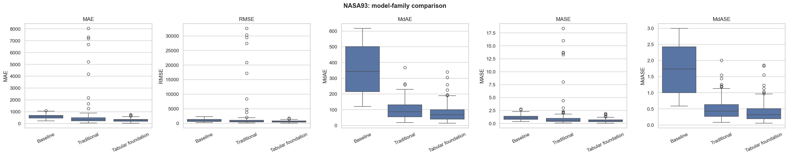
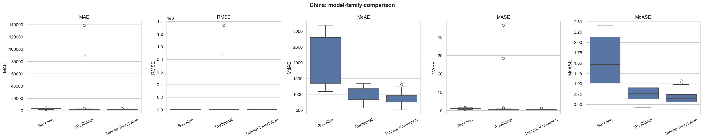
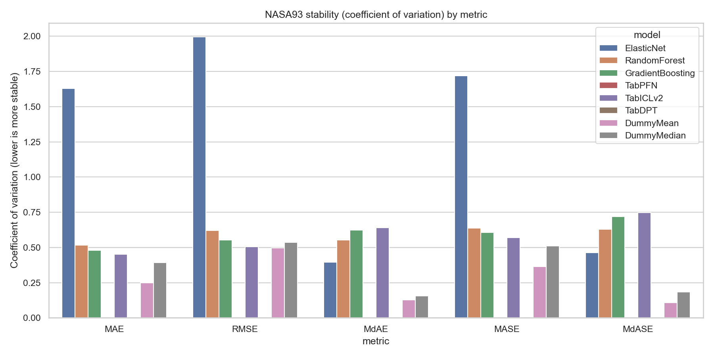
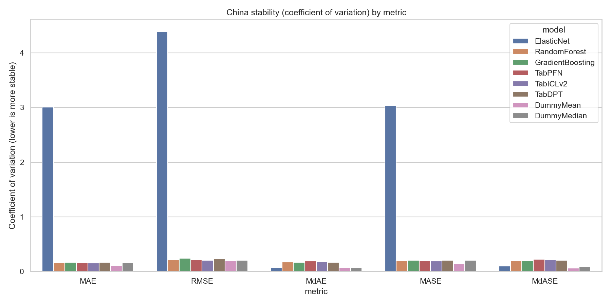

Software Effort Estimation

This repository contains a reproducible workflow for software effort estimation using public PROMISE/Zenodo datasets. The main notebook loads and audits the data, applies leakage-aware preprocessing, evaluates several model families, and exports result tables and figures for the final report.

## Study Summary

The current study compares classical software effort estimation models with newer tabular foundation models on `NASA93` and `China`. The strongest overall results come from the tabular foundation model family:

- `TabPFN` is the best individual model for mean-based metrics (`MAE`, `RMSE`, `MASE`) on both datasets.
- `TabICLv2` is strongest for median-based metrics (`MdAE`, `MdASE`) on `NASA93`.
- `TabDPT` is strongest for median-based metrics (`MdAE`, `MdASE`) on `China`.
- `RandomForest` and `GradientBoosting` remain strong lightweight alternatives, especially on `China`, where their results are close to the tabular models.
- `ElasticNet` is useful as a regularized linear reference, but it is unstable on mean-based metrics because difficult folds and extreme projects inflate its average errors.

The main conclusion is that pre-trained tabular models can transfer useful structure to small and medium software effort datasets, while classical tree ensembles remain practical baselines when simplicity, interpretability, or runtime constraints matter.

## Repository Contents

- `effort_estimation.ipynb`: main end-to-end notebook.
- `technical_report_draft.md`: draft structure for the written report.
- `requirements.txt`: Python dependencies.
- `data/raw/`: local snapshots of the source ARFF datasets.
- `data/processed/`: cleaned CSV exports generated by the notebook.
- `figures/`: plots generated by the notebook.
- `results_by_fold.csv`: fold-level evaluation results.
- `results_summary.csv`: aggregate performance summaries.
- `model_ranking.csv`: model rankings by dataset and metric.
- `stability_metrics.csv`: coefficient-of-variation stability analysis.
- `summary_table.md`: compact markdown summary table for reporting.
- `category_comparison_summary.csv`: aggregate comparison by model family.

## Dataset Strategy

The notebook tries candidate datasets in order and keeps the first two that load successfully:

1. NASA93
2. China
3. COC81 DEM

When both primary datasets load correctly, the analysis is performed on `NASA93` and `China`; `COC81 DEM` remains a fallback only. If a dataset fails parsing or validation, it is skipped automatically and the notebook continues until the minimum required number of datasets is reached.

A dataset loading diagnostic is exported as `dataset_load_report.csv`.

## Dataset Sources

- NASA93 (PROMISE/Zenodo): https://zenodo.org/records/268419
- China (PROMISE/Zenodo): https://zenodo.org/records/268446
- COC81 DEM fallback candidate (PROMISE/Zenodo): https://zenodo.org/records/268424

## Models Compared

The workflow compares three model families under the same outer validation protocol.

Traditional supervised models:

- `ElasticNet`
- `RandomForestRegressor`
- `GradientBoostingRegressor`

Tabular foundation models:

- `TabPFN`
- `TabICLv2`
- `TabDPT`

Baselines:

- `DummyRegressor(strategy="mean")`
- `DummyRegressor(strategy="median")`

The traditional models are tuned with an inner `GridSearchCV`. The tabular foundation models and dummy baselines are fitted directly on each outer training fold without inner-loop hyperparameter tuning. All serious models use a `log1p`/`expm1` target transformation so that training is more robust to effort skewness while final metrics remain on the original effort scale.

The tabular foundation models are conditionally included. If their packages, model access, tokens, weights, or runtime requirements are not available, the notebook prints a warning and skips the unavailable model instead of failing the full workflow.

## Results Snapshot

The table below summarizes the current family-level results. Lower values are better for all metrics.

| Dataset | Model family | MAE mean | RMSE mean | MdAE mean | MASE mean | MdASE mean |
|:--|:--|--:|--:|--:|--:|--:|
| China | Tabular foundation | 2302.42 | 4903.04 | 851.02 | 0.7460 | 0.6523 |
| China | Baseline | 3409.68 | 6510.71 | 2058.89 | 1.1045 | 1.5676 |
| China | Traditional | 4051.03 | 20089.28 | 990.53 | 1.3193 | 0.7573 |
| NASA93 | Tabular foundation | 287.90 | 596.82 | 79.28 | 0.5684 | 0.4010 |
| NASA93 | Baseline | 592.60 | 1032.12 | 356.54 | 1.1586 | 1.7200 |
| NASA93 | Traditional | 627.63 | 1883.47 | 99.94 | 1.2782 | 0.5010 |

The best individual models by aggregate metric are:

| Dataset | Best on MAE/RMSE/MASE | Best on MdAE/MdASE |
|:--|:--|:--|
| China | `TabPFN` | `TabDPT` |
| NASA93 | `TabPFN` | `TabICLv2` |

These results show two useful patterns. First, the tabular foundation models consistently lead the ranking in this run. Second, the traditional tree ensembles remain much stronger than the dummy baselines and are close to the tabular models on `China`, so they remain useful when a lighter sklearn-only workflow is preferred.

For the complete model-level table, see [`summary_table.md`](summary_table.md). For full rankings by dataset and metric, see [`model_ranking.csv`](model_ranking.csv).

## Visual Evidence

### Model-family comparison



This figure compares baseline, traditional, and tabular foundation model families on `NASA93` across all metrics.



This figure shows the same model-family comparison on `China`, where traditional tree ensembles are more competitive but tabular foundation models still lead overall.

### Stability analysis



The stability plot for `NASA93` shows relative fold-to-fold variability by model and metric. It helps distinguish models that are accurate on average from models that are also consistent across validation splits.



The stability plot for `China` provides the same coefficient-of-variation view for the larger dataset.

## Validation and Metrics

The evaluation uses repeated outer cross-validation for generalization estimation. For models with hyperparameter grids, an inner cross-validation loop selects parameters only inside the current outer training fold.

Reported metrics:

- `MAE`: Mean Absolute Error
- `RMSE`: Root Mean Squared Error
- `MdAE`: Median Absolute Error
- `MASE`: fold-wise scaled MAE
- `MdASE`: fold-wise scaled MdAE

`MASE` and `MdASE` are adapted for this tabular regression setting by scaling against a median-based naive predictor fitted on each training fold.

## Preprocessing and Leakage Controls

The notebook separates variables into numerical, ordinal categorical, and nominal categorical groups. Numerical variables are median-imputed, ordinal software ratings are ordinal-encoded, and remaining categorical variables are one-hot encoded.

Preprocessing is embedded inside sklearn pipelines so that imputers, encoders, scalers, and model-specific transformations are fitted only on training data within each fold.

For the China dataset, leakage-prone effort-derived columns are removed before modeling, including `ID`, `N_effort`, `PDR_AFP`, `PDR_UFP`, `NPDR_AFP`, and `NPDU_UFP`.

## Environment Setup

```bash
cd assignment1_part2_effort_estimation
python3 -m venv .venv
source .venv/bin/activate
pip install --upgrade pip
pip install -r requirements.txt
```

The tabular foundation model dependencies are listed in `requirements.txt`:

- `tabpfn`
- `tabicl`
- `tabdpt`

Depending on the environment, these models may require additional model downloads, accepted licenses, tokens, GPU support, or other local configuration. The notebook is designed to continue with the available models if one of these dependencies cannot be used.

## Run the Notebook

```bash
jupyter notebook
```

Open and run:

- `effort_estimation.ipynb`

Optional non-interactive execution:

```bash
jupyter nbconvert --to notebook --execute --inplace effort_estimation.ipynb
```

Full execution can take time because the notebook performs repeated cross-validation and may run large tabular foundation models.

## Outputs Produced

After execution, the notebook writes or updates:

- `dataset_load_report.csv`
- `results_by_fold.csv`
- `results_summary.csv`
- `model_ranking.csv`
- `stability_metrics.csv`
- `summary_table.md`
- `figures/eda_target_*.png`
- `figures/boxplot_<dataset>_<metric>.png`
- `figures/stability_coefvar_<dataset>.png`
- `figures/*_tabular_vs_traditional.png`
- `category_comparison_summary.csv`


The repository can also be used as a starting point for related studies. A future experiment can reuse the data-loading pattern, leakage-aware preprocessing, nested evaluation loop, metric exports, and visualization structure while replacing the datasets or extending the model specifications.
